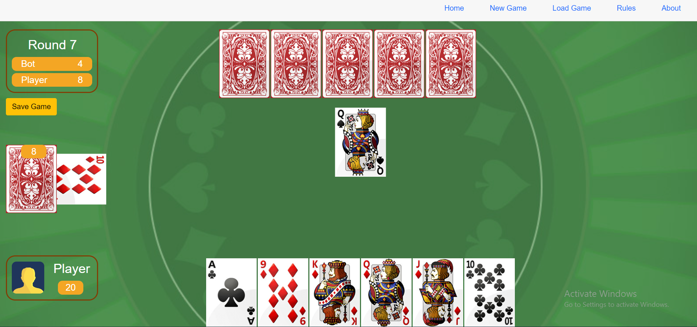

# SantaseCardGame
Blazor WebAssembly Santase (also known as 66, Sixty-Six) is a classic card game for 2 players with a deck of 24 cards.

https://jolly-sand-0b76fd803.1.azurestaticapps.net/

## Rules
https://en.wikipedia.org/wiki/Sixty-Six_(card_game)

## Screenshots

